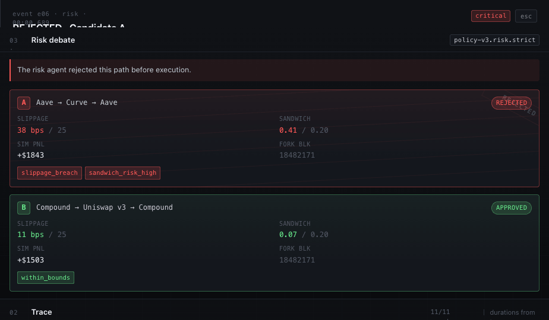
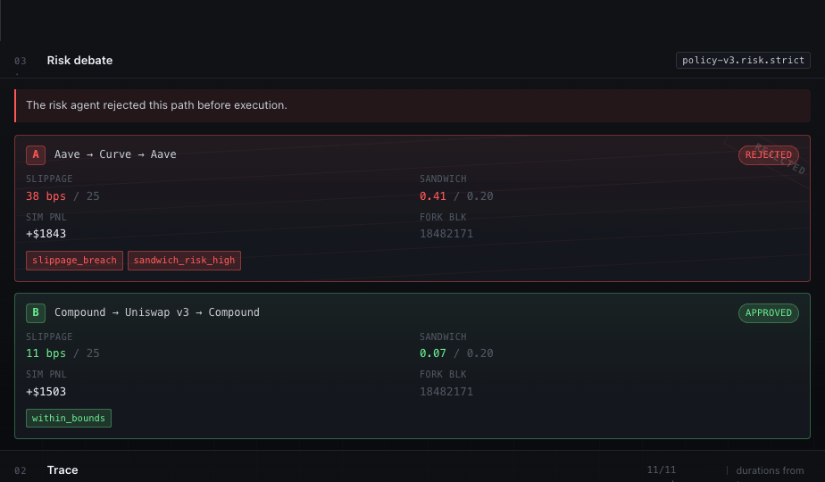

# Agent Black Box — Design Spec

A flight recorder for autonomous on-chain agents. Implementation-ready spec for `apps/web`.



---

## 1. Product feel

| Feels like                 | Does **not** feel like              |
|----------------------------|-------------------------------------|
| incident command           | a generic AI chatbot                |
| chain forensics            | a landing page                      |
| agent observability        | a meme game                         |
| high-trust infrastructure  | a trading dashboard / SaaS marketing|

Design principles:

- **Receipts over rhetoric.** Every assertion on screen is backed by a hash, timestamp, or block number.
- **Dense, scannable, no decoration.** No orbs, no purple-blue gradients, no nested cards-in-cards.
- **State is encoded in color.** Color is reserved for verified / warn / rejected / replay. Everything else is neutral.
- **Forensic posture.** The rejected path is *more* visually loud than the approved one — the value is in the block, not the success.

---

## 2. Screen layout

Single-page application. Sticky 52px header, three-column grid below, drawer overlays from the right.

```
┌─────────────────────────────────────────────────────────────────────────────┐
│ HEADER  brand · tagline                  session · network · status         │
├──────────────────┬───────────────────────────────────────┬──────────────────┤
│ 03 RISK DEBATE   │ 02 TRACE TIMELINE                     │ 04 ONCHAIN PROOF │
│ ──────────────── │ ───────────────────────────────────── │ ──────────────── │
│ risk copy        │ 01 · system   t · anchored            │ proof copy       │
│                  │      Session opened                   │                  │
│ Candidate A      │ 02 · planner  t · anchored            │ HASH MATCH       │
│   REJECTED       │      Plan generated                   │   verified  =    │
│   slippage 38bps │ 03 · sim      t · anchored            │   local = chain  │
│   sandwich 0.41  │ 04 · sim      t · anchored            │                  │
│   reasons[]      │ 05 · risk     t · anchored            │ registry  0x9B3a │
│                  │ 06 · risk     t · CRITICAL (rejected) │ session   0x7c4e │
│ Candidate B      │ 07 · policy   t · anchored            │ events    11     │
│   APPROVED       │ 08 · executor t · pending             │ content   0x4a7b │
│   slippage 11bps │ 09 · chain    t · confirmed           │ tx        0xd1e2 │
│   sandwich 0.07  │ 10 · registry t · anchored            │ block     18.4M  │
│   reasons[]      │ 11 · system   t · anchored            │                  │
│                  │                                       │ explorer · tx ↗  │
│                  │                                       │ registry      ↗  │
│                  │                                       │ trace.json    ↓  │
└──────────────────┴───────────────────────────────────────┴──────────────────┘
                                                  ┌──── DRAWER (overlay) ────┐
                                                  │ event id · role · t      │
                                                  │ TITLE                    │
                                                  │ plain-english explain    │
                                                  │ hash compare (local=chain│
                                                  │ payload.json (syntax)    │
                                                  └──────────────────────────┘
```

Grid template:

```css
.grid {
  display: grid;
  grid-template-columns: minmax(320px, 360px) minmax(0, 1fr) minmax(340px, 380px);
  gap: 0;
}
```

Breakpoints:

- **≥1180px** — full 3-column.
- **940–1180px** — narrower side panels (`320px / 1fr / 340px`); tagline hides.
- **<940px** — single column stack (Risk → Timeline → Proof). Drawer goes full-bleed.

---

## 3. Component hierarchy

```
<App>
  <Header state session/>
  [if state===failure] <FailureBanner onReplay/>
  [if state===empty]   <EmptyState onRun/>
  [else]
    <main.grid>
      <RiskDebate events state>
        <Candidate variant="rejected" id="A" path verdict simData/>
        <Candidate variant="approved" id="B" path verdict simData/>
      </RiskDebate>
      <Timeline events visibleCount selectedId onSelect state>
        <TimelineEvent ev idx selected onSelect visible/> × N
      </Timeline>
      <ProofPanel session state events>
        <HashMatchIndicator state/>
        <ProofRow k="registry"|...>
        <ProofLinks/>
      </ProofPanel>
    </main>
    <Drawer event onClose>
      <Explain type/>
      <HashCompare local chain/>
      <JsonView data/>
    </Drawer>
  <TweaksPanel> (dev-only, opt-in)
</App>
```

Shared atoms: `Pill`, `Mono` (truncating, click-to-copy), `StatusDot`, `SeverityGlyph`, `HashStatus`, `Button`.

---

## 4. Color tokens

All tokens defined on `:root`. Use `color-mix(in oklab, ...)` for translucent backgrounds; this keeps state colors harmonious at low alpha.

| Token        | Value                              | Use                                    |
|--------------|------------------------------------|----------------------------------------|
| `--bg-0`     | `#0A0B0E`                          | Page background (near-black, cool)     |
| `--bg-1`     | `#101216`                          | Primary panel surface                  |
| `--bg-2`     | `#14171D`                          | Nested surface (cards, inputs, json)   |
| `--bg-3`     | `#1A1E26`                          | Row hover                              |
| `--bd-1`     | `#1F232C`                          | Hairline border (default)              |
| `--bd-2`     | `#2A2F39`                          | Stronger border (hover/focus)          |
| `--bd-3`     | `#3A4150`                          | Strongest neutral border               |
| `--fg-0`     | `#F2F4F8`                          | Primary text                           |
| `--fg-1`     | `#C8CCD4`                          | Secondary text                         |
| `--fg-2`     | `#7E8694`                          | Tertiary text / metadata               |
| `--fg-3`     | `#515866`                          | Quaternary / disabled / placeholders   |
| `--fg-4`     | `#353A44`                          | Mute (json gutter, etc.)               |
| `--ok`       | `oklch(0.86 0.18 150)`             | Verified / approved / confirmed        |
| `--warn`     | `oklch(0.82 0.16 78)`              | Pending / RPC slow / threshold-near    |
| `--rej`      | `oklch(0.70 0.21 25)`              | Rejected / critical / hash mismatch    |
| `--purple`   | `#836EF9`                          | Monad accent — replay, selection only  |
| `--*-bg`     | `color-mix(... 14%, transparent)`  | Translucent state background           |
| `--*-bd`     | `color-mix(... 32%, transparent)`  | Translucent state border               |

**Usage rules:**

- Default UI is pure neutral (bg/fg/bd tokens). Color is *information*, not decoration.
- Purple is reserved: replay state, selected timeline row, and json keys in the drawer. Never as a primary action color, never in gradients.
- The page backdrop uses two faint radial gradients (`rgba(131,110,249,0.06)` and `rgba(94,255,159,0.03)`) on top of a 48px grid pattern, then darkened with `rgba(10,11,14,0.85)`. This is the only "atmospheric" treatment in the design.

---

## 5. Typography

Two families, both from Google Fonts:

- **UI:** `Geist` — weights 400, 500, 600, 700. Tight, neutral, infrastructure-grade.
- **Mono:** `Geist Mono` — weights 400, 500, 600. Used for any hash, address, timestamp, id, reason code, and key-value label.

```html
<link href="https://fonts.googleapis.com/css2?family=Geist:wght@400;500;600;700&family=Geist+Mono:wght@400;500;600&display=swap" rel="stylesheet">
```

`body` defaults:

```css
body {
  font: 13px/1.45 "Geist", ui-sans-serif, system-ui, sans-serif;
  font-feature-settings: "ss01", "cv11";
  letter-spacing: -0.005em;
  -webkit-font-smoothing: antialiased;
}
.mono {
  font-family: "Geist Mono", ui-monospace, "JetBrains Mono", Menlo, monospace;
  font-feature-settings: "ss01","ss02","zero","cv11";
  font-size: 12px;
  letter-spacing: 0;
}
```

Scale:

| Role                          | Family | Size  | Weight | Tracking   |
|-------------------------------|--------|-------|--------|------------|
| Drawer title                  | Geist  | 17px  | 600    | -0.015em   |
| Empty-state H2                | Geist  | 22px  | 600    | -0.02em    |
| Hash-match state ("verified") | Geist  | 16px  | 600    | -0.01em    |
| Brand name                    | Geist  | 13.5px| 600    | -0.01em    |
| Panel title                   | Geist  | 13px  | 600    | -0.005em   |
| Body / event title            | Geist  | 13px  | 500    | -0.005em   |
| Pill / status                 | Geist  | 11.5px| 500    | normal     |
| Eyebrow / proof key labels    | Mono   | 10.5px| 400    | 0.08em UC  |
| Hash / mono value             | Mono   | 12px  | 400    | 0          |
| Json line                     | Mono   | 11.5px| 400    | 0          |
| Json gutter (line number)     | Mono   | 11.5px| 400    | 0          |

All-caps labels (eyebrows, key columns): mono, 10.5px, 0.08em letter-spacing.

---

## 6. Spacing and border radius

Implicit 4px grid. Panels use 16px gutter horizontally, 10–14px vertically. Inside cards, 11–12px padding.

| Token         | Value     | Use                                       |
|---------------|-----------|-------------------------------------------|
| Grid step     | 4px       | Base unit                                 |
| Panel inset   | 16px      | Horizontal padding of all side panels     |
| Panel hd pad  | 12/16/10  | Top / horiz / bottom of `.panel-hd`       |
| Card pad      | 9–12px    | Timeline cards, candidate cards           |
| Header height | 52px      | Sticky top bar                            |
| Drawer width  | min(640px, 90vw) | Right-side overlay                 |
| Gap (chips)   | 5–6px     | Reason chips, pills                       |
| Gap (rows)    | 8–14px    | Timeline events, candidate cards          |

Radii:

| Token        | Value | Use                                           |
|--------------|-------|-----------------------------------------------|
| `--radius`   | 4px   | Cards, buttons, links, panels                 |
| `--radius-lg`| 6px   | Empty-state glyph, modal-ish surfaces         |
| pill         | 99px  | Status pills, network badge                   |
| pill[square] | 3px   | Inline metadata pills (hash status, replay)   |

No drop shadows on panels. The drawer uses one: `-20px 0 60px rgba(0,0,0,0.5)`. The brand mark uses a 1px inset highlight. Everything else is flat with hairline borders.

---

## 7. Timeline event states

Each event = a row on a vertical spine.

**Anatomy:**

```
[idx]  ╎ [node]   ┌──────────────────────────────────────┐
                  │ role · timestamp · ······ · hashPill │
                  │ Title (sentence case)                │
                  │ Subtitle (mono, secondary)           │
                  └──────────────────────────────────────┘
```

Gutter: 76px (idx number + 1px spine + 18px circular node). Node fills with the severity color.

**Severity → node treatment:**

| `severity`   | Glyph | Node bg / border               | Title color |
|--------------|-------|---------------------------------|-------------|
| `info`       | `·`   | bg-1 / bd-3                     | fg-0        |
| `ok`         | `✓`   | --ok-bg / --ok-bd               | fg-0        |
| `warn`       | `▲`   | --warn-bg / --warn-bd           | fg-0        |
| `critical`   | `●`   | --rej-bg / --rej-bd + 4px halo  | **--rej**   |

Critical rows also get a left-to-right tint wash on the row background: `linear-gradient(90deg, color-mix(in oklab, var(--rej) 7%, transparent), transparent 60%)`.

**Row states:**

| State        | Treatment                                                              |
|--------------|------------------------------------------------------------------------|
| Default      | Hairline `--bd-1` card, no row bg.                                     |
| Hover        | Row bg `rgba(255,255,255,0.015)`, card border → `--bd-2`.              |
| Selected     | Row bg `rgba(131,110,249,0.05)` + 2px purple rail on left edge, card border → `--purple-bd`. |
| Critical     | Tint wash + card border → `--rej-bd` + title color = `--rej`.          |
| Out (running)| `opacity: 0; transform: translateY(6px); pointer-events: none;`        |
| In           | `opacity: 1; transform: translateY(0)` with 0.4s ease.                 |

**Hash-status pill** (top-right of card):

| `hashStatus` | Pill tone   | Label       |
|--------------|-------------|-------------|
| `anchored`   | `pill-ok`   | `anchored`  |
| `pending`    | `pill-warn` | `pending`   |
| `confirmed`  | `pill-ok`   | `confirmed` |
| `queued`     | `pill-neutral`| `queued`  |

**Running-state behavior:**

- `visibleCount` increments from 0 → N with 480–700ms jitter between events.
- A pending row at the bottom (`.tl-pending`) shows a pulsing amber dot + `awaiting next event…` until done.
- The timeline auto-scrolls to bottom when a new event lands.

**Role labels** (rendered as a small inset chip in the card top row): `system`, `planner`, `simulator`, `risk`, `policy`, `executor`, `chain`, `registry`. Lowercased, monospaced, single bg fill.

---

## 8. Risk panel states

Always shows two candidates: **A — rejected**, **B — approved**. Order matters: rejected first, because the panel exists to make the rejection memorable.

**Panel header:**

```
03 ·  Risk debate                       [policy-v3.risk.strict]
```

**Risk copy block** (between header and Candidate A):

> The risk agent rejected this path before execution.

Rendered as a 2px left rail in `--rej` with translucent red wash. This is the only place we use a left-border-accent — earned because it directly tags the panel's purpose.

**Candidate card — rejected:**

- Border: `--rej-bd`. Background: red wash gradient.
- Diagonal `REJECTED` watermark at 28° in the top-right, 0.18 opacity (CSS-only, via `::before`).
- Six faint diagonal strike lines across the card body (`.cand-strike > span × 6`) at 0.06 opacity.
- ID chip "A" filled with `--rej-bg`.
- `pill-reject` "REJECTED" in the header row.
- Metric grid (`dt/dd` 2×2): slippage (bad), sandwich (bad), sim pnl (neutral), fork blk (dim).
- Reason chips: `reason-bad` style — square 2px radius, mono, `--rej` text.

**Candidate card — approved:**

- Border: `--ok-bd`. Subtle green wash gradient at the top.
- No watermark, no strikes.
- ID chip "B" filled with `--ok-bg`.
- `pill-ok` "APPROVED".
- Same metric grid; values colored `--ok`.
- Reason chips: `reason-good`.

**Panel states:**

| App state    | Risk panel                                                              |
|--------------|-------------------------------------------------------------------------|
| empty        | Full-screen empty state replaces panel grid.                            |
| running      | Cards appear as their underlying events land (`PlanGenerated`, `SimulationResult*`, `RiskEvaluation`). Until then: `.empty-mini` placeholder ("Awaiting plan…"). |
| complete     | Both cards rendered with full data.                                     |
| replay       | Identical to complete — the replay distinction lives in the header and proof panel. |
| failure      | Same as complete (showing seeded replay data) but the page is gated by the failure banner. |

---

## 9. Proof panel states

The "first viewport" surface for proof. All critical fields visible without scrolling on a 1080p screen.

**Order:**

1. Proof copy (one sentence).
2. **Hash match indicator** — large, color-coded.
3. Proof grid (6 rows: registry, session, events, contentHash, final tx, block).
4. Explorer / download links.

**Hash match indicator** has three states:

| App state   | Tone      | Border        | State word     | Equality glyph |
|-------------|-----------|---------------|----------------|----------------|
| complete    | `--ok`    | `--ok-bd`     | `verified`     | `=`            |
| replay      | `--ok`    | `--ok-bd`     | `verified`     | `=`            |
| running     | `--warn`  | `--warn-bd`   | `pending`      | `?`            |
| failure     | `--rej`   | `--rej-bd`    | `unverified`   | `≠`            |
| empty       | (panel not rendered)                                          |

Layout: left side shows `HASH MATCH / verified` (mono label + 16px state word). Right side shows `local 0x4a7b…0c9b8a  [=]  onchain 0x4a7b…0c9b8a` with a 22px circular equality glyph between them.

**Proof grid** is a single bordered card with 6 rows separated by hairlines. Each row is `92px key column / 1fr value`. Hashes truncate as `head…tail` (12 head + 10 tail for hashes, 10+8 for addresses). Hover any mono value shows full hash; click copies to clipboard (use `Mono copy={fullHash}` atom).

Replay badge: when `state==='replay'`, a `pill-purple` square pill labeled `replay` sits in the panel header right slot.

**Links** are mono, hairline-bordered rows with right-aligned `↗` (external) or `↓` (download). On hover the arrow turns Monad purple.

---

## 10. Trace detail drawer



Slides in from the right when an event is selected. `min(640px, 90vw)` wide, full viewport height. Scrim fades in behind it. Esc / scrim-click / `esc` chip closes.

**Structure:**

```
┌─ DRAWER ─────────────────────────────────────────────┐
│ event e06 · risk · 00:00.689      [critical]  [esc]  │
│ REJECTED · Candidate A                               │
├──────────────────────────────────────────────────────┤
│ Plain-english explain (1 paragraph)                  │
├──────────────────────────────────────────────────────┤
│ local hash    0x4a7b9f2e1c8d…1b0a9f8e7d              │
│ onchain hash  0x4a7b9f2e1c8d…1b0a9f8e7d              │
│ match         = verified                             │
├──────────────────────────────────────────────────────┤
│ payload.json                              N keys     │
│  01  {                                               │
│  02    "type": "CandidateRejected",                  │
│  …                                                   │
└──────────────────────────────────────────────────────┘
```

**Explain copy** — keyed by `payload.type`, one short paragraph each:

| Type                | Text                                                                                  |
|---------------------|---------------------------------------------------------------------------------------|
| `GoalReceived`      | Goal handed to the agent with hard constraints. Constraints are pinned into the trace so risk and policy agents can be reproduced deterministically. |
| `PlanGenerated`     | Planner emits N candidate execution paths. Each candidate is scored offline; nothing has touched the chain yet. |
| `SimulationResult`  | Each candidate is forked against a recent state. We record observed vs expected slippage and MEV estimates. |
| `RiskEvaluation`    | Risk agent compares simulation outputs against policy thresholds. Verdicts are recorded for every candidate, not only the winner. |
| `CandidateRejected` | This candidate would have breached policy. It is blocked from execution and the reason codes are anchored to the trace. |
| `PolicyApproved`    | Approval is short-lived (ttl) and bound to a specific signer + allow list. Anything outside the allow list is rejected at submit time. |
| `TxSubmitted`       | Bundle submitted to the mempool. Trace records nonce, fee and call decoder output before confirmation. |
| `TxConfirmed`       | Receipt observed. Logs are stored; gas and effective price are pinned for audit.      |
| `TraceAnchored`     | `TraceRegistry.commit(sessionId, contentHash)` writes the trace digest to Monad. Anyone can verify the offchain bundle against the onchain hash. |
| `SessionSummary`    | Final tally. Hash match indicates the offchain payload reproduces bit-for-bit the value committed onchain. |

**JSON view:**

- Custom tokenizer (no external lib) → array of `{pad, tokens[]}` lines.
- Each line: 36px line-number gutter (`--fg-4`) + content. Hover row: `rgba(255,255,255,0.02)`.
- Token colors:
  - keys (`"…":`) → `--purple`
  - strings (`"…"`) → `--ok`
  - numbers / booleans → `--warn`
  - punctuation (`{ } [ ] ,`) → `--fg-3`
- `white-space: pre-wrap; word-break: break-all` so long hash strings wrap.

---

## 11. Exact UI copy

Brand:

- Product name: **Agent Black Box**
- Build pill (mono): `v0.4.2`

Tagline (header):

> A flight recorder for autonomous on-chain agents.

Proof copy:

> This trace payload hashes to the `contentHash` emitted by `TraceRegistry` on Monad testnet.

Risk copy:

> The risk agent rejected this path before execution.

Empty state:

- Eyebrow (mono UC): `no session`
- H2: **No session selected.**
- Subline: *Open a recorded trace from the registry, or run the seeded demo to see how the flight recorder captures plan → risk → execution → proof.*
- Primary button: `▶  Run demo`
- Ghost button: `browse registry`
- Tail (mono, dim): `registry · 0x9B3a…A3c1  ·  monad-testnet · chainId 10143`

Failure banner:

- Title: **RPC failed · monad-testnet primary endpoint timeout (1822 ms)**
- Subtitle (mono): `last_block=18482171 · last_seen=14:32:08Z · fallback=seeded-replay`
- CTA: `load seeded replay →`

Header meta labels (mono UC, `--fg-3`): `session`, `network`, `status`.

Status word per state: `Idle`, `Running`, `Confirmed`, `Replayed`, `RPC failed`.

Network badge: `monad-testnet · 10143` (purple pill with dot).

Panel eyebrows: `02 ·` Trace timeline, `03 ·` Risk debate, `04 ·` Onchain proof.

Proof key column (mono UC): `registry`, `session`, `events`, `contentHash`, `final tx`, `block`.

Proof links: `explorer · tx ↗`, `explorer · registry ↗`, `download trace.json ↓`.

Pill labels: `anchored`, `pending`, `confirmed`, `queued`, `REJECTED`, `APPROVED`, `replay`.

Drawer chrome: eyebrow `event {id} · {role} · {t}`, close chip `esc`.

Reason codes (do not localize): `slippage_breach`, `sandwich_risk_high`, `within_bounds`, `RISK_SLIPPAGE_BREACH`, `RISK_MEV_SANDWICH_HIGH`.

Pending row: `awaiting next event…`.

---

## 12. React / CSS implementation notes

**Stack assumption:** React 18, no UI library. All styling in plain CSS using design tokens on `:root`. No CSS-in-JS required. If `apps/web` uses Tailwind, port tokens to `tailwind.config.ts` under `theme.extend.colors` and `theme.extend.fontFamily`.

**File layout (suggested):**

```
apps/web/
├─ src/
│  ├─ app/
│  │  └─ trace/[sessionId]/page.tsx
│  ├─ components/
│  │  ├─ Header.tsx
│  │  ├─ Timeline.tsx          // + TimelineEvent
│  │  ├─ RiskDebate.tsx        // + Candidate
│  │  ├─ ProofPanel.tsx        // + HashMatchIndicator, ProofRow
│  │  ├─ Drawer.tsx            // + JsonView
│  │  ├─ EmptyState.tsx
│  │  ├─ FailureBanner.tsx
│  │  └─ atoms/
│  │     ├─ Pill.tsx
│  │     ├─ Mono.tsx           // truncating, click-to-copy
│  │     ├─ StatusDot.tsx
│  │     └─ SeverityGlyph.tsx
│  ├─ lib/
│  │  ├─ trace.ts              // TS types: TraceEvent, Session, etc.
│  │  ├─ explain.ts            // payload.type → string map
│  │  └─ hash.ts               // truncHash, copyToClipboard
│  └─ styles/
│     ├─ tokens.css            // :root tokens
│     └─ globals.css
```

**State model:**

```ts
type AppState = 'empty' | 'running' | 'complete' | 'replay' | 'failure';

type Severity   = 'info' | 'ok' | 'warn' | 'critical';
type Role       = 'system' | 'planner' | 'simulator' | 'risk' | 'policy'
                | 'executor' | 'chain' | 'registry';
type HashStatus = 'anchored' | 'pending' | 'confirmed' | 'queued';

interface TraceEvent {
  id: string;          // e.g. "e06"
  t: string;           // "00:00.689" — offset from session t0
  role: Role;
  severity: Severity;
  title: string;
  sub: string;         // mono subtitle
  hashStatus: HashStatus;
  payload: { type: string; [k: string]: unknown };
}

interface Session {
  sessionId: `0x${string}`;
  shortSession: string;
  network: 'monad-testnet';
  chainId: 10143;
  startedAt: string; endedAt: string;
  goal: string;
  agent: string;       // "rebalance-agent@0.4.2"
  policy: string;      // "policy-v3.risk.strict"
  registry: {
    address: `0x${string}`;
    contentHash: `0x${string}`;
    chainHash: `0x${string}`;
    finalTxHash: `0x${string}`;
    blockNumber: number;
    eventCount: number;
    gasUsed: number;
  };
}
```

**State source of truth:** prefer URL params (`?session=...&replay=1`) over context for shareability. Failure state is derived (`useQuery` error + replay fallback available).

**Running-state animation:** index-driven, *not* time-driven. Increment `visibleCount` with `setTimeout` (480–700ms jitter). The list does CSS opacity/translate via `.tl-row.is-in` / `.is-out`. Don't rely on layout animation libs — the transform is cheap.

**Auto-scroll on running:** in a `useEffect([visibleCount, state])`, set `listRef.current.scrollTop = listRef.current.scrollHeight`. Do **not** call `scrollIntoView`.

**Truncation helper:**

```ts
export const truncHash = (h: string, head = 8, tail = 6) =>
  !h ? '' : h.length <= head + tail + 2 ? h : `${h.slice(0, head)}…${h.slice(-tail)}`;
```

**Click-to-copy `Mono`:** swallow click, write to clipboard, swap text to "copied" for 900ms. `title={fullValue}` so native tooltip shows the full hash.

**JSON view:** prebuild lines with a tokenizer; render `<span>` per token with `jt-k / jt-s / jt-n / jt-b / jt-p` classes. Don't reach for Prism / Shiki — payloads are small, and we want only 5 token types.

**Drawer scrim + animation:**

```css
.drw { transform: translateX(100%); transition: transform .28s cubic-bezier(.4,.2,.2,1); }
.drw.is-open { transform: translateX(0); }
```

Mount the drawer node always; toggle `.is-open`. Keep `aria-hidden` in sync.

**Accessibility:**

- Header status uses both color and a leading dot.
- Severity is conveyed by glyph (`·`, `✓`, `▲`, `●`) *and* color.
- Timeline rows: `role="button" tabIndex={0}`, Enter/Space → select.
- Drawer: trap focus, restore focus to the originating row on close, close on Esc.
- Color contrast: all foreground/background pairs ≥ 4.5:1 against intended bg surface. Verify `--fg-2` on `--bg-1` (≈ 7:1) and `--fg-3` on `--bg-1` (≈ 4.6:1) — `--fg-3` is decorative only (key labels, eyebrows).

**Backdrop:** the global gridded backdrop is purely cosmetic — feel free to drop it on low-end clients. It's two `radial-gradient`s + two 48px linear grids on `body`, dimmed by a fixed-position dark overlay (`body::before { background: rgba(10,11,14,0.85) }`).

**Performance:**

- The page is mostly static once mounted. Don't re-render the entire timeline when selection changes — memoize `TimelineEvent` on `(ev.id, selected, visible)`.
- JSON view is memoized on `data` reference.
- Drawer is always-mounted but `transform: translateX(100%)` means it's offscreen — no perf cost.

**Do not:**

- Add nested cards inside cards.
- Add hero copy, marketing prose, decorative orbs, or purple-blue gradient backgrounds.
- Use Inter, Roboto, or system sans — the spec is locked to Geist for visual identity.
- Use color as decoration. If the color isn't telling the user *what state something is in*, it shouldn't be there.

---

## Assets

| Path                             | Description                                 |
|----------------------------------|---------------------------------------------|
| `assets/desktop-main.png`        | Full desktop layout, state = `complete`.    |
| `assets/trace-detail.png`        | Drawer open on rejected event `e06`.        |
| `assets/mobile.png`              | <940px single-column collapse.              |
